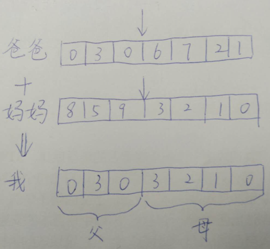
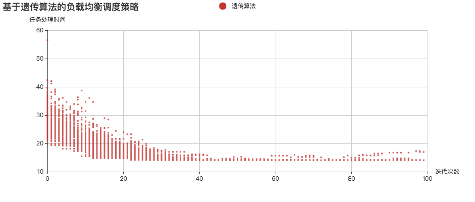

> 大自然有种神奇的力量，它能够将优良的基因保留下来，从而进化出更加强大、更加适合生存的基因。遗传算法便基于达尔文的进化论，模拟了自然选择，物竞天择、适者生存，通过N代的遗传、变异、交叉、复制，进化出问题的最优解。遗传算法看似神奇，但实现思路却较为简单。本文先跟大家介绍遗传算法的基本思想，然后用遗传算法来解决一个实际问题，最后给出遗传算法的代码实现和解析。废话不多说，现在就开始吧～

## 遗传算法
在开始之前，我们先来了解下遗传算法中的几个概念。

### 概念1：基因和染色体
在遗传算法中，我们首先需要将要解决的问题映射成一个数学问题，也就是所谓的“数学建模”，那么这个问题的一个可行解即被称为一条“染色体”。一个可行解一般由多个元素构成，那么这每一个元素就被称为染色体上的一个“基因”。

比如说，对于如下函数而言，[1,2,3]、[1,3,2]、[3,2,1]均是这个函数的可行解（代进去成立即为可行解），那么这些可行解在遗传算法中均被称为染色体。
> 3x+4y+5z<100

这些可行解一共有三个元素构成，那么在遗传算法中，每个元素就被称为组成染色体的一个基因。


### 概念2：适应度函数
在自然界中，似乎存在着一个上帝，它能够选择出每一代中比较优良的个体，而淘汰一些环境适应度较差的个人。那么在遗传算法中，如何衡量染色体的优劣呢？这就是由适应度函数完成的。适应度函数在遗传算法中扮演者这个“上帝”的角色。

遗传算法在运行的过程中会进行N次迭代，每次迭代都会生成若干条染色体。适应度函数会给本次迭代中生成的所有染色体打个分，来评判这些染色体的适应度，然后将适应度较低的染色体淘汰掉，只保留适应度较高的染色体，从而经过若干次迭代后染色体的质量将越来越优良。

### 概念3：交叉
遗传算法每一次迭代都会生成N条染色体，在遗传算法中，这每一次迭代就被称为一次“进化”。那么，每次进化新生成的染色体是如何而来的呢？——答案就是“交叉”，你可以把它理解为交配。

交叉的过程需要从上一代的染色体中寻找两条染色体，一条是爸爸，一条是妈妈。然后将这两条染色体的某一个位置切断，并拼接在一起，从而生成一条新的染色体。这条新染色体上即包含了一定数量的爸爸的基因，也包含了一定数量的妈妈的基因。



那么，如何从上一代染色体中选出爸爸和妈妈的基因呢？这不是随机选择的，一般是通过轮盘赌算法完成。

在每完成一次进化后，都要计算每一条染色体的适应度，然后采用如下公式计算每一条染色体的适应度概率。那么在进行交叉过程时，就需要根据这个概率来选择父母染色体。适应度比较大的染色体被选中的概率就越高。这也就是为什么遗传算法能保留优良基因的原因。

> 染色体i被选择的概率 = 染色体i的适应度 / 所有染色体的适应度之和

### 概念4：变异
交叉能保证每次进化留下优良的基因，但它仅仅是对原有的结果集进行选择，基因还是那么几个，只不过交换了他们的组合顺序。这只能保证经过N次进化后，计算结果更接近于局部最优解，而永远没办法达到全局最优解，为了解决这一个问题，我们需要引入变异。

变异很好理解。当我们通过交叉生成了一条新的染色体后，需要在新染色体上随机选择若干个基因，然后随机修改基因的值，从而给现有的染色体引入了新的基因，突破了当前搜索的限制，更有利于算法寻找到全局最优解。

### 概念5：复制
每次进化中，为了保留上一代优良的染色体，需要将上一代中适应度最高的几条染色体直接原封不动地复制给下一代。

假设每次进化都需生成N条染色体，那么每次进化中，通过交叉方式需要生成N-M条染色体，剩余的M条染色体通过复制上一代适应度最高的M条染色体而来。

## 遗传算法的流程
> 通过上述概念，相信遗传算法的大致原理你已经了解，下面我们将这些概念串联起来，介绍遗传算法的执行流程。

- 在算法初始阶段，它会随机生成一组可行解，也就是第一代染色体。

- 然后采用适应度函数分别计算每一条染色体的适应程度，并根据适应程度计算每一条染色体在下一次进化中被选中的概率(这个上面已经介绍，这里不再赘述)。

上面都是准备过程，下面正式进入“进化”过程。

- 通过“交叉”，生成N-M条染色体；

- 再对交叉后生成的N-M条染色体进行“变异”操作；

- 然后使用“复制”的方式生成M条染色体；

到此为止，N条染色体生成完毕！紧接着分别计算N条染色体的适应度和下次被选中的概率。

这就是一次进化的过程，紧接着进行新一轮的进化。

## 究竟需要进化多少次？
每一次进化都会更优，因此理论上进化的次数越多越好，但在实际应用中往往会在结果精确度和执行效率之间寻找一个平衡点，一般有两种方式。

### 1. 限定进化次数
在一些实际应用中，可以事先统计出进化的次数。比如，你通过大量实验发现：不管输入的数据如何变化，算法在进化N次之后就能够得到最优解，那么你就可以将进化的次数设成N。

然而，实际情况往往没有那么理想，往往不同的输入会导致得到最优解时的迭代次数相差甚远，这是你可以考虑采用第二种方式。

### 2. 限定允许范围
如果算法要达到全局最优解可能要进过很多很多很多次的进化，这极大影响系统的性能。那么我们就可以在算法的精确度和系统效率之间寻找一个平衡点。我们可以事先设定一个可以接收的结果范围，当算法进行X次进化后，一旦发现了当前的结果已经在误差范围之内了，那么就终止算法。

但这种方式也有个缺点，有些情况下可能稍微进化几次就进入了误差允许范围，但有些情况下需要进化很多很多很多很多次才能进入误差允许范围。这种不确定性导致算法的执行效率不可控。

所以，究竟选择何种方式来控制算法的迭代次数，这需要你根据具体的业务场景合理地选择。这里无法给出普世的方式，需要你自己在真实的实践中找到答案。

## 采用遗传算法解决负载均衡调度问题
算法都是用来解决实际问题的，到此为止，我想你对遗传是算法已经有了个全面的认识，下面我们就用遗传算法来解决一个实际问题——负载均衡调度问题。

> 假设有N个任务，需要负载均衡器分配给M个服务器节点去处理。每个任务的任务长度、每台服务器节点(下面简称“节点”)的处理速度已知，请给出一种任务分配方式，使得所有任务的总处理时间最短。

## 数学建模
拿到这个问题后，我们首先需要将这个实际问题映射成遗传算法的数学模型。

### 任务长度矩阵（简称：任务矩阵）
我们将所有任务的任务长度用矩阵tasks表示，如：
> Tasks={2,4,6,8}

那么，tasks[i]中的i表示任务的编号，而tasks[i]表示任务i的任务长度。

### 节点处理速度矩阵（简称：节点矩阵）
我们将所有服务器节点的处理速度用矩阵nodes表示，如：
> Nodes={2,1}

那么，nodes[j]中的j表示节点的编号，而nodes[j]表示节点j的处理速度。

### 任务处理时间矩阵
当 **任务矩阵Tasks**和**节点矩阵Nodes**确定下来之后，那么所有任务分配给所有节点的任务处理时间都可以确定了，我们用矩阵**timeMatrix**表示，它是一个二维数组：
> 1 2 <br>
2 4<br>
3 6<br>
4 8

timeMatrix[i][j]表示将任务i分配给节点j处理所需的时间，它通过如下公式计算：
> timeMatrix[i][j] = tasks[i]/nodes[j]

### 染色体
通过上文我们知道，每次进化都会产生N条染色体，每一条染色体都是当前问题的一个可行解，可行解由多个元素构成，每个元素称为染色体的一个基因。下面我们就用一个染色体矩阵来记录算法每次进化过程中的可行解。

一条染色体的构成如下：
> chromosome={1,2,3,4}

一条染色体就是一个一位数组，一位数组的下标表示任务的编号，数组的值表示节点的编号。那么chromosome[i]=j的含义就是：将任务i分配给了节点j。

上面的例子中，任务集合为Tasks={2,4,6,8}，节点集合为Nodes={2,1}，那么染色体chromosome={3,2,1,0}的含义是：
- 将任务0分配给3号节点
- 将任务1分配给2号节点
- 将任务2分配给1号节点
- 将任务3分配给0号节点

### 适应度矩阵
通过上文可知，在遗传算法中扮演者“上帝”角色的是适应度函数，它会评判每一条染色体的适应度，并保留适应度高的染色体、淘汰适应度差的染色体。那么在算法实现时，我们需要一个适应度矩阵，记录当前N条染色体的适应度，如下所示：
> adaptability={0.6, 2, 3.2, 1.8}

adaptability数组的下标表示染色体的编号，而adaptability[i]则表示编号为i的染色体的适应度。

在负载均衡调度这个实例中，我们将N个任务执行总时长作为适应度评判的标准。当所有任务分配完后，如果总时长较长，那么适应度就越差；而总时长越短，则适应度越高。

### 选择概率矩阵
通过上文可知，每次进化过程中，都需要根据适应度矩阵计算每一条染色体在下一次进化中被选择的概率，这个矩阵如下所示：
> selectionProbability={0.1, 0.4, 0.2, 0.3}

矩阵的下标表示染色体的编号，而矩阵中的值表示该染色体对应的选择概率。其计算公式如下：
> selectionProbability[i] = adaptability[i] / 适应度之和

## 遗传算法的实现
> 上述一切知识点铺垫完成之后，接下来我们就可以上代码了，相信Talk is cheap, show you the code!

```js
/**
 * 遗传算法
 * @param iteratorNum 迭代次数
 * @param chromosomeNum 染色体数量
 */
function gaSearch(iteratorNum, chromosomeNum) {
    // 初始化第一代染色体
    var chromosomeMatrix = createGeneration();

    // 迭代繁衍
    for (var itIndex=1; itIndex<iteratorNum; itIndex++) {
        // 计算上一代各条染色体的适应度
        calAdaptability(chromosomeMatrix);

        // 计算自然选择概率
        calSelectionProbability(adaptability);

        // 生成新一代染色体
        chromosomeMatrix = createGeneration(chromosomeMatrix);

    }
}
```
代码一来，一切都清晰了，似乎不需要过多的解释了。
上面是遗传算法最主要的框架，其中的一些细节封装在了一个个子函数中。在理解了遗传算法的原理后，我想代码不需要我作过多的解释了吧～完整的代码在我的Github上，欢迎Star。

## 结果展示

上述算法一共进行了100次进化，每次进化都会生成100条染色体。图中的横坐标表示进化次数，而纵坐标表示任务执行时间。
从图中我们可以看到，当进化约20次的时候，算法渐渐收敛于最优解。

## 写在最后
完整的代码在我的Github上，欢迎下载，欢迎Star！
代码中包含三个文件：

- ga.html：展示的页面
- GA.js：遗传算法的完整代码
- common.js：通用的JS代码

各位大佬直接打开ga.html即可查看算法执行结果。也欢迎各位关注我的个人公众号，不定期分享不正经程序员的心路历程。